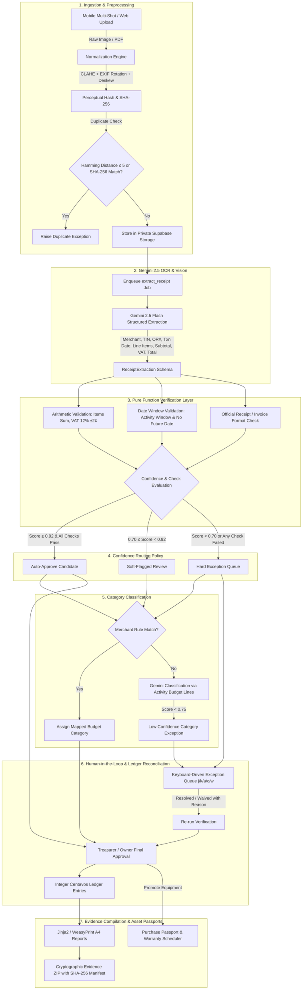

# Katibay System Architecture

Katibay is an automated receipt verification, audit reconciliation, and digital asset warranty pipeline designed for student organizations, institutions, and auditable treasuries.

---

## 1. High-Level Pipeline Architecture

The pipeline processes physical receipts and invoices through strict cryptographic, vision, arithmetic, and rules layers before committing entries into the official organization ledger.

---

## 2. Confidence Policy Table

The verification engine enforces deterministic thresholds across confidence scores, arithmetic tolerances, and categorization rules:

| Tier / Metric                     | Threshold Range                                        | Pipeline Behavior                                                | Exception Kind       | Blocking Severity       |
| :-------------------------------- | :----------------------------------------------------- | :--------------------------------------------------------------- | :------------------- | :---------------------- |
| **Auto-Approval**                 | $\text{Confidence} \ge 0.92$                           | Direct pass to classification when all deterministic checks pass | None                 | None                    |
| **Soft-Flagged Review**           | $0.70 \le \text{Confidence} < 0.92$                    | Highlighted for visual treasurer inspection                      | `low_confidence`     | Non-blocking / Advisory |
| **Low Confidence Exception**      | $\text{Confidence} < 0.70$                             | Routed to 3-pane keyboard exception queue                        | `low_confidence`     | Blocking                |
| **Arithmetic Tolerance**          | $\pm 2\text{ centavos}$                                | Subtotal + VAT (12%) vs Total tolerance                          | `arithmetic_error`   | Blocking                |
| **Line Items Check**              | Exact match                                            | Sum of line items must equal subtotal                            | `missing_line_item`  | Blocking                |
| **Date Window Check**             | $\text{Activity Start} \le \text{Date} \le \text{End}$ | Transaction date must fall within activity dates                 | `date_out_of_window` | Blocking                |
| **Future Date Check**             | $\text{Date} \le \text{Today}$                         | Transaction date cannot be in the future                         | `future_date`        | Blocking                |
| **Category Confidence**           | $\text{Score} < 0.75$                                  | Falls back from merchant rules to Gemini budget match            | `low_confidence`     | Blocking                |
| **Perceptual Hash Deduplication** | $\text{Hamming Distance} \le 5$                        | Checks against existing receipts in the same workspace           | `duplicate_receipt`  | Blocking                |

---

## 3. Core Architectural Modules

### 3.1 Preprocessing & Deduplication (`services/api/src/katibay_api/preprocessing.py`, `duplicates.py`)

- **EXIF-based auto-rotation** and skew angle correction.
- **CLAHE (Contrast Limited Adaptive Histogram Equalization)** contrast normalization.
- **Perceptual Image Hash (`imagehash.phash`)** computed over downscaled 1600px normalized JPEG.
- Prevents redundant OCR jobs by detecting duplicate photographs within Hamming distance $\le 5$.

### 3.2 Pure Function Verification (`services/api/src/katibay_api/verification/`)

- All verification checks are implemented as **pure functions** without database side-effects:
  - `verify_arithmetic()`: Tolerates rounding within 2 centavos per operation.
  - `verify_date_window()`: Compares against activity bounds.
  - `verify_or_number_format()`: Validates BIR official receipt formats.
  - `verify_future_date()`: Rejects future timestamps.
  - `evaluate_confidence_routing()`: Returns auto-approve, soft-flag, or exception states.
- Every exception failure yields plain-language English questions and Filipino translation keys with suggested correction values.

### 3.3 Classification & Integer Centavos Reconciliation (`services/api/src/katibay_api/classification/`, `reconciliation/`)

- Rules layer checks regular expression patterns against `merchant_rules`.
- Falls back to structured LLM categorization picking only from existing activity `budget_lines`.
- All monetary arithmetic is executed in **integer centavos** (`₱1.00 = 100 centavos`), eliminating floating-point rounding errors.

### 3.4 Purchase Passports & Expiry Scheduler (`services/api/src/katibay_api/passports/`)

- Verified receipts for capital equipment (cameras, monitors, printers, PA systems) can be promoted into **Asset Passports**.
- Automatic calculation of `warranty_expires_at = purchase_date + interval(months)`.
- Scheduled notification engine monitors expiration horizons across 4 tiers:
  - $\le 60\text{ days}$: `notice_60d`
  - $\le 30\text{ days}$: `warning_30d`
  - $\le 7\text{ days}$: `critical_7d`
  - $\le 0\text{ days}$: `expired`
- Generates official **Warranty Claim Packet PDFs** containing receipt proof, equipment specifications, defect narratives, and chronological audit histories.

### 3.5 Evidence Compilation & A4 Print Engine (`services/api/src/katibay_api/reports/`)

- Jinja2 HTML templates styled for A4 print:
  - `liquidation_report.html`
  - `expense_summary.html`
  - `variance_report.html`
  - `claim_packet.html`
- Rendered to PDF via WeasyPrint using the same semantic design tokens as the web application.
- `build_evidence_packet(activity_id)` produces a signed ZIP containing the 3 reports, all approved receipt images, and a `manifest.json` listing SHA-256 hashes and confidence ratings.

### 3.6 Security, Rate Limiting & Telemetry (`services/api/src/katibay_api/ratelimit.py`, `metrics.py`, `storage.py`)

- **Sliding-Window Rate Limiter**: Enforces a maximum of 60 uploads per minute per client IP.
- **Signed URLs**: Generates temporary image read URLs with strict 60-second expiration.
- **Sentry Integration**: Tracing and error reporting initialized via `SENTRY_DSN`.
- **Prometheus `/metrics`**: Exposes `job_queue_depth`, `extraction_latency_p50_ms`, `extraction_latency_p95_ms`, and `exception_rate`.

---

## 4. Mobile Offline-First Architecture (`apps/mobile`)

- **One-Handed Thumb Flow**: 72px tactile shutter button with document edge guide and rapid multi-shot counter.
- **SQLite Local Queue**: Persists captures offline with SHA-256 hashes, timestamps, and retry counts.
- **Reconnection Engine**: Reconciles server receipt IDs and synchronizes queued captures automatically when connectivity returns.
- **Shared Tokens**: 100% color and typography parity with the web design system.
